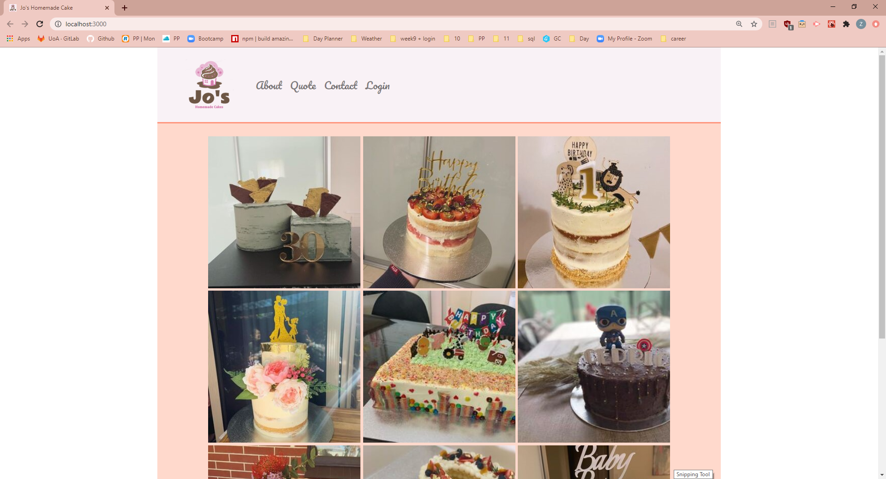

# Jo's Homemade Cakes
## [Visit The Site!](https://jos-homemade-cakes.herokuapp.com/)

## Description

This is an application where customers can request for a quote for a cake. The app has functionality for admin login to view database of quote placed. The idea came from a chat with my close friends who runs a cake business as a side job and received high amounts of cake order during the pandemic.

**User Story**
* AS a home baker
* I WANT to be able to provide customer a form to place a cake order and display my products
* SO I can organise my cake business better and promote my business

## Technologies

* **Mongodb** 
* **BootstrapCSS**
* **React**
* **Firebase Auth**
* **Node.js**
* **Express**
* **Moment.js**
* **@hapi/joi** - for data validation

## Screenshot

## Authors

* [Ziyen Loh](https://github.com/zyloh89)

## [License](LICENSE.md)

This project is provided under the MIT license.
